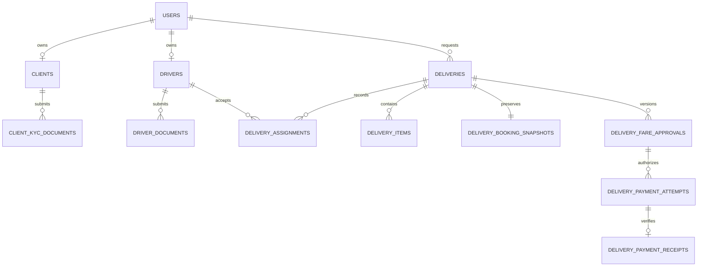

# Tweak Insight Logistics — enterprise engineering audit

**Review date:** 29 September 2026. **Disposition: not approved for production release.**

**Source:** local `fix/audit-reliability-20260919` working tree based on commit `27d62af093daf957596ecf581b958be37660c123`, including the earlier reliability and fare/payment changes. This review did not fetch or verify a newer GitHub HEAD. Changes described as fixed are local source changes, not deployed behavior. No remote push, live database migration or provider charge was performed.

The pre-review checkpoint is `til-before-enterprise-review-2026-09-29.patch`, SHA-256 `ade4733d3b817bdad1a3ec970ae12d8e6b1a6e233e9c7d1852aff4f85eccc750`. Preserve it with the incremental patch: it contains the previous work on which this review depends.

## 1. Executive Summary

The project has a useful production-oriented foundation: owner-scoped APIs, current-database role checks, short-lived bearer tokens, rotating refresh sessions, private KYC storage controls, atomic booking with scoped idempotency, a durable booking outbox, immutable fare approvals and receipts, and server-to-server Paystack verification. These are source implementations; real provider acceptance and native database contention remain release gates.

The actual stack is **custom PHP 8.2-compatible code, PDO/MySQL SQL, React 18, Bootstrap, TanStack Query, Axios and Leaflet**. This checkout is not a Laravel/Sanctum/Spatie or React 19/TypeScript/Vite implementation. It is a multi-role application; tenant isolation for independent SaaS businesses is not implemented.

This pass fixed confirmed defects in account registration, KYC decisions/uploads, proof audit propagation, notification display/pagination, login redirects, logging, maintenance execution and Nginx routing. It also upgraded React Router from 6.30.6 to 7.18.4, removed unused `web-vitals`, and classified build tools as development dependencies. The remaining dependency audit reports **28 affected package entries: 14 high, 5 moderate, 9 low, 0 critical**, predominantly the Create React App toolchain. That count is not a count of exploitable production endpoints.

The starting inventory contained 334 tracked files. The evidence inventory covers every included project file as it exists after this work, including generated assets, tests and configuration. All project PHP files were syntax-parsed; frontend lint/tests/build resolve the imported application graph. Detailed manual review concentrated on authentication, money, delivery custody, KYC, queries, storage, queues, routing and deployment. This is not a claim that every possible defect has been discovered, that third-party dependency internals were exhaustively reviewed, or that a deployed penetration/load/accessibility audit was performed.

**Evidence bundle:**

- [File inventory, hashes, duplicates and import candidates](audit/file-inventory.json).
- [78 API routing cases with handlers, named permissions and rate-limit calls](audit/api-route-inventory.json). A case may include aliases; this is not 78 distinct HTTP paths.
- [34-table relationship/index inventory](audit/database-inventory.json).
- [Static review triggers](audit/static-review-triggers.json), which are candidates, not automatically vulnerabilities.
- [Backend test results](audit/backend-test-results.json), [PHP parsing](audit/php-syntax.json), [frontend tests](audit/frontend-tests.txt), [lint](audit/frontend-lint.txt), [build](audit/frontend-build.txt), [release test](audit/frontend-release-tests.txt).
- [Dependency audit before](audit/npm-audit-before.json) and [after](audit/npm-audit-after.json).

## 2. System Architecture Review

### Current structure and responsibility

| Area | Evidence | Assessment |
|---|---|---|
| Entry points and routing | `backend/public/{api.php,index.php,.htaccess}`, `backend/api/index.php`, `backend/router.php`, `backend/index.php` | A public document root exists. CLI development routing, Apache rewriting and Nginx need the same release/health behavior; Nginx defects were corrected in this pass. |
| Controllers | `backend/controllers/` | Controllers mix request parsing, SQL, decisions and responses. The central router has 78 cases. Decompose by use case without changing public contracts in a single rewrite. |
| Domain behavior | `backend/helpers/{delivery_booking,delivery_payments,driver_delivery_progress,delivery_resolution,kyc_workflow,account_registration}.php` | The transactional services are the preferred extraction pattern. Older operations mutations still have weaker audit/transaction boundaries. |
| Persistence | `backend/config/database.php`, `database/schema.sql`, `scripts/migrate_*.php` | Prepared statements, explicit relations and additive migration scripts exist. A migration registry, schema compatibility gate and verified restore procedure are still needed. |
| Async processing | `helpers/{job_queue,booking_outbox,payment_webhooks,report_export}.php`, `queue/redis/*.lua`, `scripts/queue_worker.php` | Reservation leases, retries and recovery exist. External notification dispatch deliberately fails when no real provider is configured; logging does not count as sending a message. |
| Infrastructure | `helpers/{storage_adapter,upload_security,client_ip,rate_limiter,cache_helper,logger}.php`, `backend/deploy/` | Good security primitives, but configuration and platform services must be verified in the target environment. Redis is still a production dependency of the current rate-limit configuration. |
| Frontend | `frontend/src/App.js`, `components/{admin,client,driver,common,landing}`, `api/`, `utils/` | Route splitting and reusable components exist. Several large tabs and duplicated data-state patterns make regression risk high. |
| Assets/build | `frontend/{public,src/assets}`, `backend/public/static`, `frontend/scripts/deploy-backend-build.js` | Source and compiled copies are expected. A release pointer avoids mixed-version chunks; no release was activated during this audit. |
| Tests/docs | `backend/tests`, `frontend/src/**/*.test.js`, `backend/docs`, `README.md` | Useful behavioral suites coexist with source/reflection checks. The latter do not demonstrate endpoint or concurrent database behavior. |

Retain a modular monolith for this scale. Keep API processes stateless, use MySQL as the authoritative record, and isolate worker workloads. Microservices would add failure modes before the existing contracts and release gates are complete.

### Master Feature Roadmap reconciliation

“Implemented” below means source support exists, not that a production acceptance gate passed.

| Planned area | Status | Concrete evidence | Remaining scope |
|---|---|---|---|
| Payments and COD | **Partial** | `helpers/{delivery_payments,paystack_gateway,payment_webhooks,payment_money}.php`; `controllers/PaymentController.php`; fare/attempt/receipt/webhook tables; `common/PaymentReviewPanel.js`, `PaymentReturn.js` | Fare approval, customer acceptance and provider verification exist. Real Paystack sandbox acceptance, reconciliation, actual refunds/payouts and a COD collection/remittance ledger are not complete. |
| Proof of delivery | **Implemented — OTP path** | `DeliveryController::confirmReceipt`, `OperationalRecords::otpProofCaptured`, `delivery_proofs`, driver `ActiveDeliveriesTab.js` | Status, proof and mandatory audit are now linked. Photo/signature evidence, retention policy and exception resolution are additional features. OTP completion is not payment or payout evidence. |
| Smarter dispatch | **Partial** | `AdminController::materializeEligibleOffers`, `DeliveryPersonController::acceptDelivery`, `SpatialHelper`, offers/assignments/availability tables | Eligibility, payload checks, first-accept locking and distance ordering exist. Sorting an insert that offers to every eligible driver is not ranked dispatch waves, capacity planning, ETA prediction or route optimization. |
| Customer live tracking | **Implemented — online path** | `LiveTrackingController`, `DeliveryPersonController::updateLocation`, `delivery_location_events`, `ClientTrackingTab`, `LiveLocationMap` | Owner authorization and stale-location handling exist. Sustained mobile reconnect, actual device permissions and PHP worker capacity need deployed testing. |
| Scheduled or multi-stop delivery | **Partial** | `BookingInput`, delivery preferred-time fields, `BookDeliveryTab`, `service_type=scheduled` | Scheduled inputs exist. No complete stop sequence/leg model or time-window dispatch orchestration was found. |
| Offline driver mode | **Not found** | No durable offline command queue/reconciliation in the imported frontend graph | A manifest alone does not provide offline delivery actions. Add IndexedDB commands, idempotency and conflict UX only after online transitions are stable. |
| Support and disputes | **Partial** | Driver issue reporting, `ExceptionsAlertsTab`, failed-delivery handling and payment dispute holds | No full ticket/case ownership, SLA, communications history, evidence review or approved refund workflow was found. |
| Address intelligence | **Partial** | `KanoServiceArea`, `SpatialHelper`, `client_addresses`, coordinate fields and booking forms | Local service-area validation exists. The address table alone does not establish autocomplete, verified reusable addresses, address quality scoring or geocoding confidence. |

## 3. Identified Errors & Fixes

The following changes are implemented locally. Storage/service behavior was exercised where the environment permits; native-server caveats are in section 11.

| ID | Severity | Defect and impact | Corrected implementation |
|---|---|---|---|
| E01 | High | User creation could succeed before profile creation failed, leaving an account without its required operational identity. Duplicate registrations could produce an unhandled database error. | `account_registration.php`: required profile/availability/audit writes in one transaction; rollback on any failure; database uniqueness conflict mapped to 409. `transactional_schema.php` requires InnoDB tables on MySQL. |
| E02 | Medium | Auth JSON arrays, objects or oversized text could cause type errors or database truncation errors. | `http_input.php` and `AuthController.php`: bounded object parsing, typed lengths, positive IDs and byte-limited passwords. Registration retains Kano address validation. |
| E03 | High | Concurrent password changes could overwrite a newer password after checking an older hash. | `AuthController::changePassword`: compare-and-update against the checked hash; token-version change and refresh revocation commit together; conflict returns 409. Native race acceptance remains required. |
| E04 | High | KYC state/documents were checked outside the approval transaction; concurrent upload/review could change the approved evidence. | `kyc_workflow.php`, `ClientKycController`, `AdminController`: serialize on profile/document rows, recheck state under lock, write decisions and mandatory audit together. A verified client cannot replace evidence through the ordinary upload route. |
| E05 | High | Driver approval counted expired verified documents and could reset a suspended account to active. | Driver approval/review now require unexpired mandatory documents, preserve account suspension, and commit account/profile/availability/audit together. Queue document counts also exclude expired evidence. |
| E06 | Medium | Driver metadata validation ran after object storage, leaving files behind on invalid expiry input. Submission audit was best-effort. | Validate metadata before storage; use `KycWorkflow::recordUpload` for atomic metadata/audit; remove the new object on failed metadata persistence. A durable orphan reconciler is still needed for storage outages. |
| E07 | High | OTP proof passed `required=true`, but its audit call did not propagate that requirement; delivery history was also best-effort. | `operational_records.php` propagates required audit failure. `confirmReceipt` requires history. Availability checks retain busy state while another parcel remains in custody, including failed deliveries. |
| E08 | Medium | Both notification interfaces referenced nonexistent API fields and hid records beyond the first 50. Counts reflected loaded rows. | `notification_inbox.php`, `NotificationController`, shared `common/NotificationInbox.js`: canonical body/status fields, owner/channel scoping, server search/unread/order/page controls and account-wide unread counts. |
| E09 | Medium | A query-string return destination was passed directly to navigation; the installed router had an applicable untrusted-path advisory. | `safeReturnPath.js` allowlists internal destinations, rejects separators/control characters and normalization tricks. Router updated to 7.18.4; protected-route redirects preserve query/hash. |
| E10 | High | `Logger::debug` and `Logger::critical` were called but absent, breaking expired-token/configuration error paths. CLI uncaught errors could terminate without a failure exit status. | Added both methods; CLI fatal handling exits 1. API aliases consistently return JSON for uncaught errors. HTTP logging avoids the response output stream. |
| E11 | Medium | Request URLs could log tracking/payment query values; request IDs and log fields were unbounded. | `log_sanitizer.php`: remove query strings, bound/control-strip text and request IDs, redact sensitive structured keys; use JSON-line files. This does not guarantee arbitrary free-text messages contain no sensitive data. |
| E12 | High | The maintenance runner required scripts in-process; KYC cleanup calls `exit`, preventing later jobs. Export retention was omitted. | `maintenance_runner.php`, `run_all_maintenance.php`, `purge_stale_file_cache.php`: separate bounded child processes, continue after failures, nonzero aggregate exit, include authorized-export retention. Native process execution still needs acceptance. |
| E13 | High | Nginx served the legacy static index rather than the active release; `/health/ready`, bare notifications and payment webhook aliases could miss API routing. Child cache headers suppressed inherited security headers. | `deploy/nginx/til.conf`: PHP release resolver, corrected API matching, preserved dashboard root paths and security-header inheritance. Native `nginx -t`/HTTP probes are still required. |
| E14 | Low | One-page lists could not change page size; current-page semantics were missing; disabled browser storage could crash theme selection. | Shared `Pagination.js` retains page-size controls and accessible current-page labels; `ThemeContext.js` handles blocked storage. Dispatch pagination labels now use customer-facing language. |

Regression evidence: `verify_enterprise_boundaries.php` adds **58 assertions** covering malformed requests, registration rollback/duplicates, KYC rollback/replay/expiry/suspension, proof-audit rollback, notification ownership/filtering/pagination, maintenance continuation and log sanitization. Other delivery/payment suites retain their previous passing behavior. The new frontend tests exercise real QueryClient pagination and the canonical notification contract, not merely snapshots.

## 4. Security Vulnerability Report

Severity reflects impact under stated conditions, not a claim that the condition exists in production.

| Area | Current control and evidence | Remaining risk/remediation | Priority |
|---|---|---|---|
| SQL injection | PDO placeholders; shared allowlisted sort columns in `ListingQuery`; notification wildcard search is escaped | No confirmed raw unauthenticated SQL-injection sink was established in reviewed paths. Finish converting old admin/fleet/business payloads to typed bounded input; audit every new dynamic identifier. | Medium |
| XSS | React text rendering, CSP, private document streaming, upload MIME/signature/scanning controls | Deploy consistent CSP across Apache/PHP/Nginx; assess third-party map/font domains. HTML generation or future rich-text content requires independent sanitization. | Medium |
| CSRF | Most mutations require memory-held Authorization bearer tokens. Refresh requires allowed origin and a non-simple header; cookie has HttpOnly/Secure/SameSite settings. | Validate actual browser/CORS/cookie behavior behind the selected proxy. CORS alone is not authorization. | High release gate |
| Authentication/session | Current DB role/account/token version checked; refresh hashes stored; rotation/reuse handling exists | Install locked Composer dependencies, test real JWT expiry/logout/password races. Add issuer/audience boundaries and admin MFA before broader operations access. | High |
| RBAC | `authorization_policy.php` denies unknown roles; admin has wildcard permissions | There is no least-privilege dispatcher/finance/support split or tenant boundary. Introduce explicit permissions and dual control for financial adjustments if those roles are required. | High before enterprise/multi-tenant use |
| Credentials | `security_config.php` rejects weak/default/revoked JWT credentials and root DB accounts; `.env.example` documents configuration | Prior exposure remediation requires actual rotation and least-privilege grants. Repository checks do not prove deployed credentials were rotated. Treat confirmed active credential exposure as Critical and rotate immediately. | Critical if active exposure; otherwise release evidence gate |
| Passwords | `password_hash`/`password_verify`; bcrypt byte bound | Add rehash-on-login when policy changes; consider account-specific throttling and MFA. No plaintext password persistence is introduced. | Medium |
| Uploads | `upload_security.php`, private `storage_adapter.php`, `secure_document_download.php`; 10 MB KYC limit | Real ClamAV/S3 encryption and access denial must be demonstrated. Add durable cleanup intents/orphan reconciliation and review-version binding so an operator explicitly approves the exact document version viewed. | High |
| Payment/webhook | Fixed-origin gateway, HMAC verification, durable webhook inbox, immutable receipt and exact amount/currency/reference/account checks | Real signed sandbox callbacks, wrong-account/reference/amount cases, duplicate delivery, timeout recovery and reconciliation are unverified. No COD/refund/payout implementation should be inferred. | High release gate |
| Operational audit | Mandatory for booking, fares/payments, driver milestones, new KYC/account work and proof | `AdminController::manualAssign`, `releaseAssignment`, `broadcastDeliveryOffer` still contain post-transaction/best-effort records. Move history/audit into their owning transactions. Several configuration mutations remain best-effort. | High, open |
| Input bounds | Strong booking/payment/new-auth/KYC boundaries | Some legacy fleet/business/admin endpoints still coerce values and lack complete lengths/ranges/date validation. This can cause 500s, invalid configuration or excessive queries. | Medium, open |
| Logs | Query stripping, bounded request IDs, structured redaction added | Free-text exception messages at legacy call sites can still contain data; centralize safe error codes, restrict log access and configure rotation/retention. | Medium, open |
| Rate limiting | Redis policy with trusted-proxy resolution; limited public sensitive endpoints | Verify all mutation/read abuse budgets under actual proxy headers. Current production configuration still requires Redis; a documented MySQL-only production design is a separate change. | High deployment compatibility gate |
| Dependencies | Runtime router advisory fixed; 28 entries remain in full audit | Replace the deprecated CRA build stack in a dedicated migration; do not use `npm audit fix --force`, which proposes an unsuitable `react-scripts@0.0.0`. Isolate build/development servers and assess each advisory's reachability. | High supply-chain backlog |

The router advisory affects versions below 7.18.0; the installed replacement is 7.18.4. React has deprecated Create React App. Primary references: [React Router advisory](https://github.com/remix-run/react-router/security/advisories/GHSA-wrjc-x8rr-h8h6), [React CRA announcement](https://react.dev/blog/2025/02/14/sunsetting-create-react-app). PHP JWT is locked to 7.0.0 in `composer.lock`; a full Composer advisory/install check was not run because native Composer and its installed vendor tree were unavailable here.

## 5. Database Review

The canonical schema is `backend/database/schema.sql`; the evidence bundle lists all 34 tables, foreign keys and indexes. It is a sensible starting point, not a reason to replace the database wholesale.

This is a logical core view. In SQL, `deliveries.client_id` and `delivery_person_id` reference **users**, whereas `delivery_assignments.driver_id` references **drivers**. Rename these concepts in application DTOs/documentation before a database-column migration; mixing them is an integration risk.

- **Keys/normalization:** one-to-one profile uniqueness, separate document/rule/item/history tables and explicit foreign keys are useful. Snapshot/quote/item duplication is deliberate historical denormalization. Specify which source governs editable display versus contractual fare; do not recalculate old accepted fares from mutable rate cards.
- **1NF–3NF:** scalar operational columns and separate repeating relations broadly fit relational normalization. JSON metadata/snapshots are appropriate immutable evidence. Querying business-critical values only from unvalidated JSON would weaken constraints; retain typed amount/status/owner columns.
- **Integrity:** immutable booking/fare/receipt triggers exist in migration paths. Verify they were actually installed; table creation alone is insufficient. Add a database-enforced single current assignment after duplicate preflight. Version-bind reviews and refunds, and make append-only audit permissions explicit.
- **Indexes:** retain the delivery owner/status/time, assignment, session, queue and export indexes already provided. Candidate prefix overlaps include `users(role,is_approved)` and `(role,is_approved,id)`; remove only after workload plans and index-usage observation, especially because InnoDB includes the primary key in secondary indexes.
- **Queries:** shared paginated queries bind limits. Rate-card retrieval batches rules by IDs, avoiding a rule query per card. Pending KYC lists use correlated aggregates; measure them and replace with grouped summaries if the plan repeatedly scans large document sets.
- **Deletes:** cascading profile/document deletes may conflict with operational evidence retention. Use account suspension/closure and explicit retention workflows; avoid blanket soft deletes on immutable receipts/history. Define retention and erasure policies before destructive cleanup.
- **Migration/backup:** track applied migration versions/checksums; preflight actual server/version (XAMPP may run MariaDB), existing columns, engines and duplicate data. Use a separate migration credential. Back up database and private-object metadata together, encrypt backups and prove a restore before release.

An [optimized-schema proposal](audit/SCHEMA_PROPOSAL.sql) supplies preflight queries, a current-assignment uniqueness constraint and an inbox index candidate. It is **design SQL, not an applied migration**. Add future multi-stop/support/COD structures only with their transactional service workflows, not empty tables marketed as completed features.

## 6. Performance Analysis

Measured local evidence is limited to the build and deterministic tests. No production query latency, throughput or p95 improvement is claimed.

| Workload | Evidence / concern | Measurable acceptance target |
|---|---|---|
| Main frontend | Production main JS approximately 109.67 kB gzip; main CSS approximately 48.56 kB gzip; route chunks exist in build output | Keep initial JS below 170 kB gzip and CSS below 60 kB gzip while testing complete route cost on a midrange Android device. These are proposed budgets, not measured device timings. |
| Listings | Owner/status filters, limits and cursor paths exist; wildcard searches and counts may scan widely | On a representative staging dataset: p95 list API under 300 ms, payload under 100 kB for 25 rows; record EXPLAIN, rows examined and query count. |
| Booking/payment | Transactions protect critical writes; provider calls occur outside booking/receipt transactions | At 50 concurrent booking clients: zero duplicate deliveries per scoped key, zero partial histories/outbox records, and no network call while holding the booking transaction. Record p95 separately from provider latency. |
| Live tracking | `LiveTrackingController::stream` can occupy a PHP request worker for 60 seconds and polls state | Measure 100/250 concurrent viewers with ordinary API traffic. No request-pool starvation; expired authorization must terminate the stream. Do not extrapolate from single-user tests. |
| Dispatch | Set-based insertion avoids per-driver round trips, but distance sorting still evaluates eligible drivers | Benchmark 1,000 and 10,000 drivers; introduce fresh-location/radius candidate filtering and dispatch waves if plans breach the budget. Set-based is not constant computational complexity. |
| Exports | Private async exports use 500-row reads; legacy sync report caps at 10,000 rows | Export 100,000 matching rows with stable bounded worker memory, lease recovery and reauthorization. It is not a frozen financial snapshot. |
| Maintenance | Auth/session/rate/GPS purges include potentially large deletes | Batch large purges with indexed cutoffs; target under 1 second per delete batch and inspect locks/replica lag. New child timeout is a failure boundary, not a substitute for batching. |
| Cache | `CacheHelper` supports KPI caching | Define TTL/invalidation and cache-key scope; benchmark cold and warm reads. Never serve private owner data from a shared unscoped key. |

Use PHP OPcache and correctly sized FPM/Apache pools, gzip/Brotli at the web tier, hashed-asset caching and image dimensions/lazy loading. Keep source maps private in release artifacts; old tracked public maps remain a cleanup/release-policy concern. Slow-query logging must omit sensitive parameter values.

## 7. Scalability Recommendations

1. First make the single deployment observable and repeatable. Scale stateless API instances only after shared queue/rate-limit/storage configuration passes failover tests; local file cache cannot be treated as cluster-wide state.
2. Keep MySQL authoritative for assignment, money, idempotency and durable outbox/inbox state. Add read replicas only for explicitly stale-tolerant reporting; do not send checkout/assignment decisions to lagging replicas.
3. Put exports, reconciliation and notifications on supervised workers with bounded concurrency, retry limits, lease renewal, dead-letter alerts and backpressure. Separate latency-sensitive booking projection from large exports when metrics justify it.
4. Replace per-viewer PHP SSE polling with a dedicated event delivery service or a measured polling fallback before scaling to many simultaneous viewers. Do not introduce a second source of shipment truth.
5. Introduce keyset pagination for deep event/audit/location histories. Use a stable `(timestamp,id)` cursor for timestamp sorting; a cursor based only on ID must not claim arbitrary-sort support.
6. Decide explicitly whether the product serves one logistics business or multiple independent tenants. Multi-tenant service requires tenant-owned data, composite uniqueness, scoped queries, tenant-aware workers/exports and cross-tenant negative tests throughout.

## 8. UI/UX Improvement Report

This was a component/style/interaction-code review, not a pixel or WCAG certification on a deployed site. `index.css` has 4,831 lines, with extensive global/dark-mode selectors, while several dashboard tabs exceed 500 lines. This increases unintended cross-view styling changes.

| Interface | Evidence and issue | Recommended display |
|---|---|---|
| Admin / operations | `AdminDashboard`, `admin/OverviewTab`, `DeliveriesTab`, `OperationsTabs`, `DocumentReviewTab`, `ExceptionsAlertsTab` | Lead with actionable queues: requests awaiting review, unassigned jobs, failed custody, payment holds and expiring documents. Separate operations from finance/configuration navigation. One primary action per row; use a detail drawer for secondary data. |
| Client | `ClientDashboard`, `ClientOverviewTab`, `BookDeliveryTab`, `ShipmentHistoryTab`, `ClientPaymentsTab`, `ClientTrackingTab` | Prioritize Book delivery, Active deliveries and Track. Show estimated versus approved fare clearly; show Payment verified only with receipt evidence. Keep mass/distance internals out of ordinary booking choices. |
| Driver | `DeliveryPersonDashboard`, `DriverOverviewTab`, `ActiveDeliveriesTab`, `AvailableJobsTab`, `PartnerOperationsTab` | Mobile-first current job, next permitted action, pickup/payment clearance, recipient confirmation and availability. Distinguish accrued earnings from paid-out funds. Explain GPS denial/staleness with a recovery action. |
| Notifications | New shared `NotificationInbox` | Correct body/read status, global unread count, keyboard-operable actions, server filters and older-page access are implemented. |
| Tables and forms | Shared `Pagination`, `formValidation`, `LoadMoreButton`, role-specific filters | Use consistent labels, aligned numeric columns, stable sorts, clear total/filtered counts and reset-filter actions. Associate validation errors with fields and focus the first failing input. |
| Maps/tracking | `LiveLocationMap`, `ClientTrackingTab`, `TrackingModal` | Display last-update age and accuracy; offer a text timeline and contact/help action. A map must not be the only way to understand status. |
| Theme/accessibility | `ThemeContext`, `index.css`, shared dialogs/icons | Consolidate semantic tokens; verify text contrast in both themes, visible keyboard focus, modal focus trapping/return, screen-reader names and reduced motion. Theme storage failure is now handled. |
| Public pages | `Home`, `landing/*`, `AboutPage`, `CareersPage`, `ContactPage`, `CoveragePage`, `TermsAndConditions` | Align claims with implemented service coverage and support availability. Reuse header/footer/spacing patterns and test links/forms. Marketing copy must not imply offline/COD/support workflows that are absent. |

Suggested design system: a neutral page background, one brand accent for primary actions, consistent semantic status colors plus text, 16 px body text, a limited spacing scale, reusable card/table/form primitives, and at least 44 px driver touch targets. Validate at 360/390/768/1440 px widths with keyboard-only and screen-reader checks. Treat these as acceptance criteria, not a claim that current colors meet contrast ratios.

### Pagination and data-management coverage

| Listing family | Current status | Remaining work |
|---|---|---|
| Admin delivery, audit, fleet, rate-card, exception lists | Server bounds/search or filtering and allowlisted ordering in relevant controllers; existing R09 work preserved | Verify every UI control sends the same filter to API and export. Benchmark count/LIKE queries and deep-page plans. |
| Admin user/partner queues | Cursor/offset variants and bounded result sizes | Complete consistent search/sort/page-size contracts and strict query typing. Document cursor envelopes instead of silently mixing formats. |
| Client delivery history | API supports server listing controls, but `ClientDashboard` still fetches pages without passing its status filter; `ShipmentHistoryTab` also filters loaded rows | **Open:** wire filter/search/sort to the parent query, reset the cursor on changes, obtain totals from server aggregates, and fetch an older notification's delivery by authorized ID rather than scanning the first 50. |
| Driver offers/assignments/earnings | SQL pagination exists | Standardize strict page bounds, search and valid filter/sort options; replace local-page totals with account aggregates where used. |
| Client/driver notifications | **Fixed in this pass** | Owner-scoped server search, read filtering, ordering, page size and global unread count. Large inbox index benchmark remains. |
| KYC document queues / business accounts | SQL lists exist; profile document history can grow | Cap or paginate driver history; add common controls and typed filters. Do not delete compliance evidence merely to shorten a UI list. |
| Reports/exports | Authorized asynchronous CSV and bounded legacy CSV | Add export job history and explicit filter/row-count metadata. PDF is not implemented; add it only for a defined printable document need. |

## 9. Redundant File Cleanup List

| Item | Evidence | Decision |
|---|---|---|
| `frontend` dependency `web-vitals` | No imported use in current source graph | Removed from manifest/lock. |
| `concurrently`, `react-scripts` under runtime dependencies | Used for local orchestration/build/test commands | Moved to devDependencies. Full build/test installation still requires dev dependencies. |
| Duplicated client/driver notification implementations | Same inbox domain and previously inconsistent field mappings | Consolidated into `common/NotificationInbox`; two tiny role wrappers preserve existing imports. |
| `components/landing/SecurityTrustSection.js` | No inbound relative import in current application graph | Retained as an unused candidate; decide whether it is planned content before deletion. |
| `hooks/useFormValidation.js` | No inbound relative import; another validation module is in active use | Retained as a consolidation candidate. Do not replace working field behavior without form regression tests. |
| Logos/favicons/manifest/robots copied between source and public build | Exact duplicate groups in inventory | Expected build/source copies. Remove only through a reproducible release pipeline, not ad hoc source deletion. |
| Tracked compiled JS/CSS/maps in `backend/public/static` | Generated output alongside source | Stop committing future build output after CI artifact/release handling is established. Keep the existing fallback until rollback/activation is verified. |
| Old status documentation | Earlier reports describe earlier stages | Preserve audit history and link the latest payment guide; do not treat historical “open” notes as the current implementation state without checking code. |

No unresolved relative frontend imports were found. A lack of import references is not proof that every file is disposable; scripts, public assets, runtime entry points and migration files are invoked outside the import graph.

## 10. Refactored Folder Structure

Recommended gradual destination, preserving current public API behavior:

| Path | Responsibility |
|---|---|
| `backend/public/` | API entry point, release resolver and immutable published assets only |
| `backend/src/Http/` | Router, request DTO validation, middleware and consistent error mapping |
| `backend/src/Domain/{Accounts,Kyc,Delivery,Dispatch,Payments,Reporting}/` | Transaction-owning use cases and state rules |
| `backend/src/Infrastructure/{Database,Queue,Storage,Providers,Logging}/` | PDO repositories, gateways and service adapters |
| `backend/database/{schema,migrations}/` | Canonical schema and versioned migrations with preflight/rollback notes |
| `backend/bin/` | Explicit CLI-only worker, maintenance and reconciliation commands |
| `backend/tests/{unit,integration,concurrency}/` | Distinguish isolated logic from actual MySQL/provider/process tests |
| `frontend/src/features/{auth,booking,dispatch,tracking,payments,kyc,notifications}/` | Feature components, hooks, API contracts and tests together |
| `frontend/src/components/ui/` | Shared accessible table/form/dialog/status primitives |
| `frontend/src/styles/` | Semantic design tokens and scoped component styles |
| `docs/{architecture,api,operations,decisions}/` | Contracts, release runbooks and versioned design decisions |

Do not mass-move files during defect repair. Extract one domain at a time behind the same route/response contract, and use Composer autoloading for new namespaced backend code. The newly extracted account/KYC/inbox services are an incremental step; this full folder migration has not been applied.

## 11. Production Deployment Checklist

### Verification performed here

| Check | Result | Limit |
|---|---|---|
| PHP syntax | **127 files parsed, zero failures** | PHP 8.2.33 WebAssembly token parser; does not execute includes or validate SQL on MySQL |
| New enterprise service suite | **58 assertions passed** | SQLite dialect adapter; not a concurrency/process test |
| Booking/outbox, payment, driver milestones, cancellation, runtime boundaries, refresh/export | **463 assertions passed**, bringing explicit backend total to **521** | SQLite/fake provider and isolated logic; no real payment/network charge |
| Additional helper/source checks | 11 further scripts reported success; 18 of 21 selected scripts passed overall | Some checks use source inspection/reflection; no code-coverage percentage claimed |
| Additional blocked checks | `verify_tracking_privacy`, `verify_telemetry_isolation`, `verify_worker_daemon` | Missing Composer autoloader and/or native PHP subprocess requirements; not counted as passes |
| Frontend | **59 tests in 13 suites passed; ESLint zero warnings; production build passed** | jsdom/component/build verification; no deployed visual or mobile E2E claim |
| Frontend release tooling | **1 Node test passed** | Isolated temporary release directory; no current release activated |
| Patch hygiene | `git diff --check` | Final packaging includes independent apply/byte verification |

The PHP WASM wrapper can report shell exit zero even after PHP termination, so test output was inspected and configuration errors were not accepted as passes. Environment-dependent checks are explicitly recorded in the result file.

### Required release gates

- [ ] Install `composer.lock` dependencies and validate native PHP extensions on the actual Windows/XAMPP or server runtime. Confirm MySQL versus MariaDB and supported version. Never serve `backend/` as the document root.
- [ ] Review all local changes and the cumulative patch. Use a feature branch; do not overwrite unrelated work or apply both patches to the same base.
- [ ] Rotate any exposed credentials, verify application/migration DB grants, configure exact origins/trusted proxies, and demonstrate refresh-cookie flags under HTTPS.
- [ ] Back up and restore a representative database plus private storage metadata into an isolated environment. Proposed initial objectives: RPO no more than 15 minutes and RTO no more than 2 hours, then approve them against business cost and tooling.
- [ ] Apply the documented operational/session/storage/queue/booking/export/payment migrations in staging. Verify InnoDB, constraints, immutable triggers and legacy data compatibility before production scheduling.
- [ ] Run native MySQL booking/payment/queue contention tests and new KYC upload-versus-review, password-change and driver availability races. Exercise client disconnect, deadlock retry and mandatory-audit failure paths.
- [ ] Run actual Paystack **test-mode** initialize/verify and signed webhook cases with wrong amount/currency/customer/reference, duplicate/reordered events, provider timeouts and dispute/refund holds. No fake “paid” flag may clear pickup.
- [ ] Configure real notification providers and verify accepted/delivered/failed states separately, or explicitly disable external dispatch and provide an operational fallback. Current stub errors must not accumulate unnoticed.
- [ ] Verify private S3-compatible storage, encryption, ClamAV, denied direct document access, retention cleanup, failed-delete recovery and authorized downloads.
- [ ] Validate Nginx/Apache configuration natively. Probe `/admin`, `/delivery`, `/api/health/live`, authorized readiness, notifications, webhook path, active release and rollback; inspect headers on HTML, API and static assets.
- [ ] Supervise workers; verify lease expiry, poison-job handling, payment inbox/outbox age alerts, stale heartbeat alerts and maintenance failure exits. Install one maintenance scheduler to avoid overlapping runs. Set log retention and monitor disk/queue growth.
- [ ] Close the open operations-audit and listing/input defects, then perform cross-role/owner negative HTTP tests and mobile browser tests at representative load.
- [ ] Prepare the immutable frontend release, review it, then separately activate it. Deploy compatible API/worker code through an atomic server release; the frontend pointer does not make backend deployment atomic.

No Docker or PostgreSQL migration is required by these recommendations. The repository's current production Redis requirement must be resolved explicitly if a MySQL-only deployment remains a requirement.

## 12. Priority-based Action Plan — Critical to Low

| Priority | Bounded work | Completion evidence |
|---|---|---|
| Critical, conditional | If any previously exposed credential is still active, rotate/revoke it and inspect authorized access logs | Old credential rejected, new least-privilege configuration works, relevant sessions revoked |
| High — next code stage | **Complete operational transaction consistency:** move manual assignment/release/rebroadcast history and audit into their owning transaction; require InnoDB; serialize release/availability against competing claims | Inject history/audit failure and observe zero partial assignment/offers/availability changes; native concurrent claim/release test passes |
| High — next acceptance stage | Native staging install, schema compatibility, payment sandbox verification and deployment/maintenance probes | Retained logs/results for every gate above; no blocked mandatory tests or unexplained reconciliation differences |
| High | Replace CRA in a separate build-system migration; preserve routing, API/session behavior, tests and release tooling | Clean reproducible build, assessed dependency audit, all routes/payment return and release rollback tested |
| High | Durable cleanup intents, exact KYC review-version binding and provider reconciliation/notification integration | Failure recovery tests; reviewed document hash/version matches approval; retry does not duplicate effects |
| Medium | Wire client history controls to server queries; standardize remaining listing/input/date/range validation; remove local-page KPI totals | Seed more than three pages; search/filter/sort/export return matching records, counts and ownership across pages |
| Medium | Add OpenAPI contracts, consistent errors/405 handling, configuration mutation audit and structured safe log codes | Schema validation and negative HTTP contract tests; documented correlation IDs and status codes |
| Medium | Query-plan/load/backup/restore/SSE capacity work | Baseline and after measurements on stated hardware/data, with latency/error/resource budgets met |
| Medium | Design tokens and role-focused mobile/accessibility refinements | Screenshot/keyboard/screen-reader checks in light/dark themes; no lost workflow or permissions |
| Low | Remove confirmed unused UI files, shrink global CSS and stop tracking future generated output | Import/build/tests pass; release rollback remains available |

The next implementation stage should stay focused on **operational transaction consistency and native acceptance**, before adding COD, multi-stop routing, offline mode or a broad dashboard rewrite. The local fixes materially improve the codebase, but the open findings and unexecuted production gates prevent a responsible production-readiness claim.
